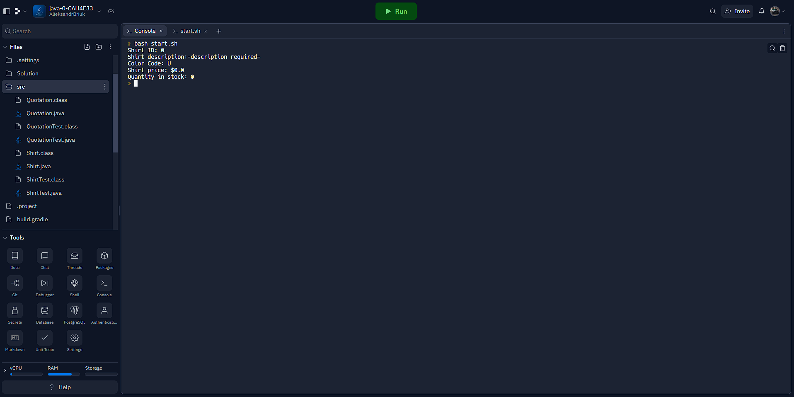
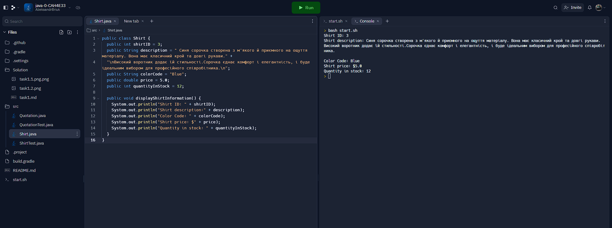

## Завдання 1.1 Початкова програма

**1. Код до програми**

``` java
public class Shirt {
  public int shirtID = 0; 
  public String description = "-description required-"; 
  public char colorCode = 'U';
  public double price = 0.0; 
  public int quantityInStock = 0; 
  
  public void displayShirtInformation() {
    System.out.println("Shirt ID: " + shirtID);
    System.out.println("Shirt description:" + description);
    System.out.println("Color Code: " + colorCode);
    System.out.println("Shirt price: $" + price);
    System.out.println("Quantity in stock: " + quantityInStock);
  } 
} 
```
**2. Скріншот результату виконання**




## Завдання 1.2 Нова програма

**1. Код до програми**

``` java
public class Shirt {
  public int shirtID = 3; 
  public String description = " Синя сорочка створена з м'якого й приємного на ощуття матеріалу. Вона має класичний крой та довгі рукави." + 
  "\nВисокий воротник додає їй стильності.Сорочка єднає комфорт і елегантність, і буде ідеальним вибором для професійного співробітника.\n"; 
  public String colorCode = "Blue";
  public double price = 5.0; 
  public int quantityInStock = 12; 
  
  public void displayShirtInformation() {
    System.out.println("Shirt ID: " + shirtID);
    System.out.println("Shirt description:" + description);
    System.out.println("Color Code: " + colorCode);
    System.out.println("Shirt price: $" + price);
    System.out.println("Quantity in stock: " + quantityInStock);
  } 
} 
```
✅ колір сорочки зберігався та виводився у вигляді рядка (red, blue, green, unset) 
``` java
public String colorCode = "Blue";
```

**2. Скріншот результату виконання**


