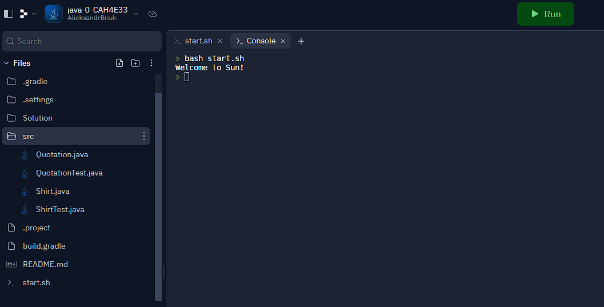
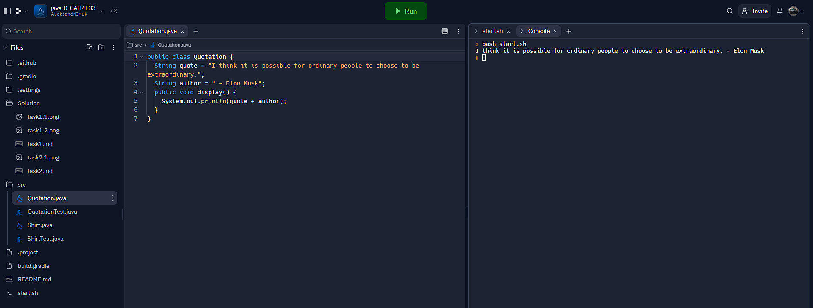

## Завдання 2.1 Початкова програма

**1. Код до програми**

``` java
public class Quotation {
  String quote = "Welcome to Sun!";
  public void display() {
    System.out.println(quote);
  }
}
```
**2. Скріншот результату виконання**




## Завдання 2.2 Нова програма

**1. Код до програми**

``` java
public class Quotation {
  String quote = "I think it is possible for ordinary people to choose to be extraordinary.";
  String author = " - Elon Musk";
  public void display() {
    System.out.println(quote + author);
  }
}
```
✅ окрім цитати виводилось ім'я того, кому вона належить 
``` java
String author = " - Elon Musk";
```
``` java
System.out.println(quote + author);
```

**2. Скріншот результату виконання**


